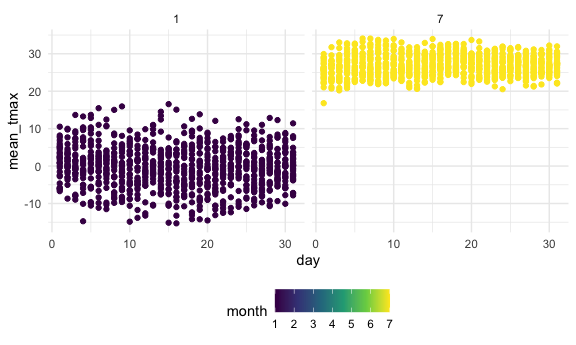
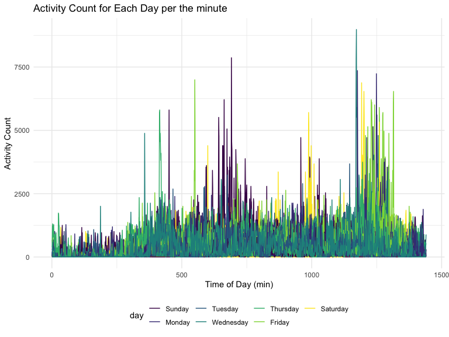
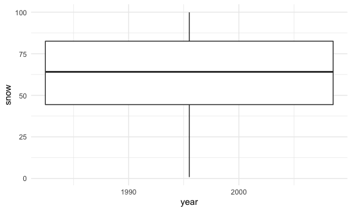

Homework 3
================
Allison Randy-Cofie
2022-10-12

## Problem 2

Load, tidy, and otherwise wrangle the data. Your final dataset should
include all originally observed variables and values; have useful
variable names; include a weekday vs weekend variable; and encode data
with reasonable variable classes. Describe the resulting dataset
(e.g. what variables exist, how many observations, etc).

``` r
accel <- read.csv("./accel_data.csv") %>% 
  janitor::clean_names() %>% 
  pivot_longer(activity_1:activity_1440,
    names_to = "minutes",
    values_to = "activity_count") %>% 
  mutate(minutes = str_sub(minutes, 10),
         minutes = as.integer(minutes),
         day = forcats::fct_relevel(day, "Sunday", "Monday", "Tuesday", "Wednesday", "Thursday", "Friday", "Saturday"),
         type_of_day = ifelse(day == "Saturday" | day == "Sunday", "weekend", "weekday"))
```

The dataset has `nrow(accel)` observations and `ncol(accel)` variables.
The variables in the dataset are minute of the day, activity count, and
day of the week.

Traditional analyses of accelerometer data focus on the total activity
over the day. Using your tidied dataset, aggregate across minutes to
create a total activity variable for each day, and create a table
showing these totals. Are any trends apparent?

``` r
accel %>% 
  group_by(day,week) %>% 
   summarize(tot_activity = sum(activity_count)) %>% 
  pivot_wider(names_from = day,
              values_from = tot_activity) %>% 
  knitr::kable()
```

    ## `summarise()` has grouped output by 'day'. You can override using the `.groups`
    ## argument.

| week | Sunday |    Monday |  Tuesday | Wednesday | Thursday |   Friday | Saturday |
|-----:|-------:|----------:|---------:|----------:|---------:|---------:|---------:|
|    1 | 631105 |  78828.07 | 307094.2 |    340115 | 355923.6 | 480542.6 |   376254 |
|    2 | 422018 | 295431.00 | 423245.0 |    440962 | 474048.0 | 568839.0 |   607175 |
|    3 | 467052 | 685910.00 | 381507.0 |    468869 | 371230.0 | 467420.0 |   382928 |
|    4 | 260617 | 409450.00 | 319568.0 |    434460 | 340291.0 | 154049.0 |     1440 |
|    5 | 138421 | 389080.00 | 367824.0 |    445366 | 549658.0 | 620860.0 |     1440 |

Accelerometer data allows the inspection activity over the course of the
day. Make a single-panel plot that shows the 24-hour activity time
courses for each day and use color to indicate day of the week. Describe
in words any patterns or conclusions you can make based on this graph.

``` r
accel %>% 
  ggplot(aes(x=minutes,y=activity_count,group=day_id, color=day))+
  geom_line()+
  labs(title = "24-hour Activity Count for Each Day",
       x = "Time of Day (min)",
       y = "Activity Count")
```


## Problem 3

The goal is to do some exploration of this dataset. To that end, write a
short description of the dataset, noting the size and structure of the
data, describing some key variables, and indicating the extent to which
missing data is an issue. Then, do or answer the following (commenting
on the results of each):

Do some data cleaning. Create separate variables for year, month, and
day. Ensure observations for temperature, precipitation, and snowfall
are given in reasonable units. For snowfall, what are the most commonly
observed values? Why? Make a two-panel plot showing the average max
temperature in January and in July in each station across years. Is
there any observable / interpretable structure? Any outliers? Make a
two-panel plot showing (i) tmax vs tmin for the full dataset (note that
a scatterplot may not be the best option); and (ii) make a plot showing
the distribution of snowfall values greater than 0 and less than 100
separately by year.

``` r
library(p8105.datasets)
data("ny_noaa")
ny_noaa =ny_noaa %>% janitor::clean_names() %>% 
  separate(date, into = c("year","month","day"),sep="-") %>% 
  mutate(
    month = as.numeric(month),
    day = as.numeric(day),
    year = as.numeric(year),
    tmax= as.numeric(tmax),
    tmin= as.numeric(tmin)
  )
```

For snowfall the most commonly observed value is 0 since it typically
only snows during winter which is only a quarter of the year.

Make a two-panel plot showing the average max temperature in January and
in July in each station across years. Is there any observable /
interpretable structure? Any outliers?

``` r
ny_noaa_tmax = 
  ny_noaa %>% 
  group_by( day,month, year) %>% 
  summarize(
    mean_tmax = mean(tmax/10, na.rm=TRUE))
```

    ## `summarise()` has grouped output by 'day', 'month'. You can override using the
    ## `.groups` argument.

``` r
ny_noaa_tmax %>% 
  filter(month==01 | month==07)%>% 
  ggplot(aes(x = day, y=mean_tmax, color= month))+
  geom_point()+
  facet_grid(. ~ month)
```



Make a two-panel plot showing (i) tmax vs tmin for the full dataset
(note that a scatterplot may not be the best option); Use density plot.
hex plot. for i

``` r
ny_noaa %>% 
  mutate(tmin=tmin/10,
         tmax=tmax/10) %>% 
  ggplot(aes(x=tmin, y=tmax))+
  geom_point()
```



2)  make a plot showing the distribution of snowfall values greater than
    0 and less than 100 separately by year.

``` r
ny_noaa %>% 
  group_by(id, year) %>% 
  summarize(snow=sum(snow/10)) %>% 
  filter( snow < 100 & snow > 0) %>% 
  ggplot(aes(x=year, y = snow)) +
  geom_boxplot()
```

    ## `summarise()` has grouped output by 'id'. You can override using the `.groups`
    ## argument.



Use denity or boxplot for this one
